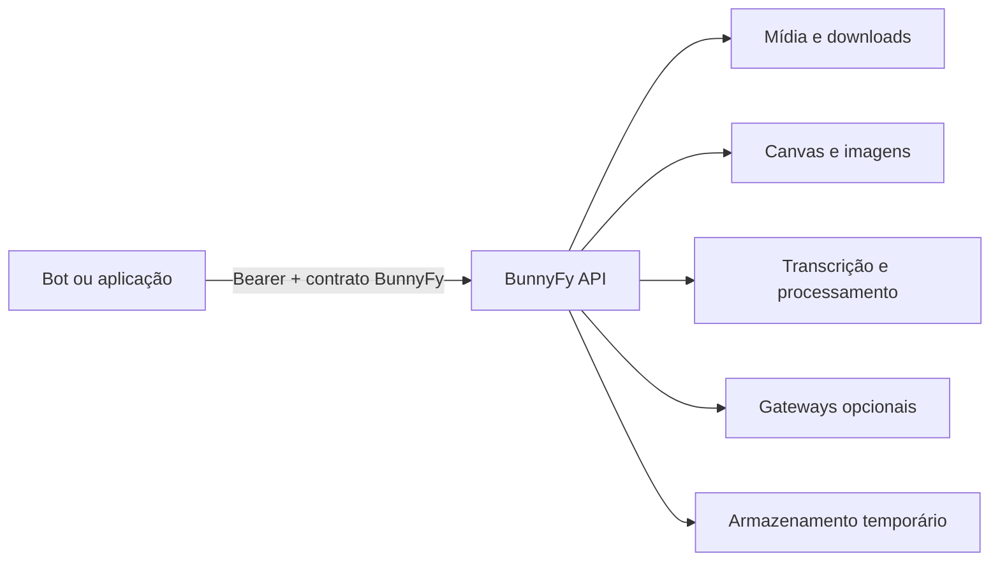

<h1 align="center">BunnyFy</h1>

<p align="center">
  <strong>Media in. Power out.</strong><br>
  API de mídia, automação e experiências visuais para bots e aplicações.
</p>

<p align="center">
  
  
  
  
</p>

<p align="center">
  <a href="#instalação-rápida">Instalar</a> ·
  <a href="#capacidades">Capacidades</a> ·
  <a href="#saúde-e-disponibilidade">Health</a> ·
  <a href="docs/instalacao/termux.md">Termux</a> ·
  <a href="docs/instalacao/desktop.md">Desktop</a>
</p>

---

## O que é

A BunnyFy é uma API própria para centralizar processamento de mídia e integrações que não devem ficar espalhadas dentro de cada bot consumidor. O servidor expõe contratos próprios, mantém credenciais de provedores no lado da API e devolve envelopes BunnyFy aos clientes.

O repositório **`dgreych/_bunnyfy_` é público e pode ser clonado por HTTPS sem chave SSH do GitHub**. Configuração privada continua fora do Git.



## Capacidades

O snapshot público inclui, entre outros blocos:

- armazenamento temporário e URLs assinadas de mídia;
- download e tratamento de mídia social;
- fluxo de YouTube com yt-dlp e runtime JavaScript configurável;
- Social Canvas e renderização de experiências visuais;
- processamento de imagens com Sharp;
- geração e manipulação de stickers/logos;
- transcrição via whisper.cpp quando o binário e o modelo existem no host;
- remoção de fundo via rembg quando o runtime e o modelo existem no host;
- geração de imagem por adaptadores internos;
- gateway de conversa por IA quando explicitamente habilitado;
- jogos e renderizadores visuais usados pelo ecossistema consumidor.

A BunnyFy separa **processo vivo** de **capacidade disponível**. Isso importa porque um notebook, um servidor Linux e um Android não possuem exatamente o mesmo conjunto de ferramentas externas.

## Instalação rápida

### Android / Termux

```bash
pkg update -y && pkg upgrade -y
git clone https://github.com/dgreych/_bunnyfy_.git
cd _bunnyfy_
bash scripts/install-termux.sh
termux-wake-lock
npm start
```

Guia completo: **[BunnyFy no Termux](docs/instalacao/termux.md)**.

### Linux

```bash
git clone https://github.com/dgreych/_bunnyfy_.git
cd _bunnyfy_
bash scripts/install-linux.sh
npm start
```

### macOS

```bash
git clone https://github.com/dgreych/_bunnyfy_.git
cd _bunnyfy_
bash scripts/install-macos.sh
npm start
```

### Windows / PowerShell

```powershell
git clone https://github.com/dgreych/_bunnyfy_.git
cd _bunnyfy_
powershell -ExecutionPolicy Bypass -File .\scripts\install-windows.ps1
npm start
```

Guia desktop: **[Linux, Windows e macOS](docs/instalacao/desktop.md)**.

## O que os instaladores fazem

Todos os instaladores públicos seguem o mesmo princípio:

1. verificam Node.js 20.12+ e as ferramentas básicas da plataforma;
2. executam `npm ci --include=optional` a partir do `package-lock.json`;
3. confirmam que o Sharp realmente consegue ser carregado;
4. criam um `.env` local válido caso ele ainda não exista;
5. validam o contrato de portabilidade do snapshot.

O setup local usa `.env.example` como molde, mas **não tenta iniciar a API com os placeholders do arquivo de exemplo**. Ele gera uma chave `bf_test_...` e um segredo de assinatura aleatórios, salva ambos no `.env` e não imprime a chave no terminal.

```bash
npm run setup:local
npm run verify:portability
```

## Termux não é um Linux de servidor fantasiado de celular

O projeto usa `sharp@0.35.3`. O lockfile público traz `@img/sharp-wasm32`, que permite ao Sharp usar WebAssembly quando não existe binário nativo Android, e também contém os pacotes Android do esbuild usados pelo `tsx`.

O instalador Android preserva dependências opcionais com:

```bash
npm ci --include=optional
```

Isso permite que **o servidor BunnyFy inicialize no Termux**. Recursos pesados ainda dependem do que estiver instalado no aparelho. Whisper, rembg e ferramentas semelhantes podem exigir setup adicional e mais memória do que faz sentido pedir a um telefone que já está tentando sobreviver ao Android.

## Saúde e disponibilidade

Depois de iniciar:

```bash
curl http://127.0.0.1:8080/health
```

`GET /health` é público e confirma que o processo HTTP está vivo.

```bash
curl http://127.0.0.1:8080/ready
```

`GET /ready` inspeciona armazenamento, ferramentas, modelos e capacidades. Uma integração opcional ausente pode aparecer como `false` sem derrubar o servidor principal.

## Configuração

A aplicação carrega `.env` automaticamente no boot. Dois itens são obrigatórios para uma configuração válida:

- pelo menos uma chave BunnyFy em `BUNNYFY_API_KEYS`;
- `MEDIA_SIGNING_SECRET` com pelo menos 32 caracteres.

O bootstrap local cuida disso para desenvolvimento. Em produção, forneça credenciais próprias por ambiente seguro.

Exemplo de formato de chave:

```text
bf_test_<segredo-aleatório>
bf_live_<segredo-aleatório>
```

Nunca versione `.env` nem replique credenciais internas nos consumidores.

## Ferramentas externas

| Capacidade | Ferramenta adicional | Necessária para o servidor iniciar? |
|---|---|---:|
| HTTP, armazenamento temporário, contratos | Node.js | sim |
| Processamento Sharp / Canvas | backend Sharp da plataforma ou WASM | sim para rotas que importam Sharp |
| Conversões e mídia | FFmpeg / ffprobe | não |
| YouTube direto | yt-dlp + runtime JS compatível + FFmpeg | não |
| Transcrição | whisper.cpp + modelo | não |
| Remoção de fundo | rembg + modelo | não |
| IA / provedores privados | credenciais do ambiente | não |

## Desenvolvimento

```bash
npm ci --include=optional
npm run setup:local
npm run verify
npm run verify:portability
npm start
```

Comandos úteis:

```bash
npm run typecheck
npm run lint
npm test
npm run preflight
```

## Portabilidade verificada no GitHub Actions

O CI público faz três coisas separadas:

- roda typecheck, lint e testes no baseline suportado;
- instala um **clone limpo** em Linux, Windows e macOS nas linhas Node 20.12, 22 e 24 e confirma o carregamento do Sharp;
- valida o contrato do Termux, incluindo os artefatos Android/WASM do lockfile e o instalador Android.

Além disso, o job principal cria um `.env` de teste, sobe a API como um clone recém-baixado e exige resposta real em `/health`.

Isso não transforma CI Linux em um emulador Android. O que ele faz é muito mais útil do que uma promessa decorativa: impede que o repositório público volte a aceitar um lockfile ou um bootstrap que já sabemos ser incompatível com o caminho Termux.

## Produção

O setup local serve para desenvolvimento, teste e validação do clone público. Produção deve usar segredos próprios, ferramentas provisionadas no host e o fluxo de deploy controlado do projeto.

## Segurança

- não versione `.env`;
- não exponha chaves BunnyFy em URL ou log;
- não coloque credenciais internas de provedores nos bots consumidores;
- use escopos mínimos por consumidor;
- trate URLs de mídia assinadas como temporárias.

---

<p align="center"><strong>BunnyFy</strong><br><sub>Media in. Power out.</sub></p>
