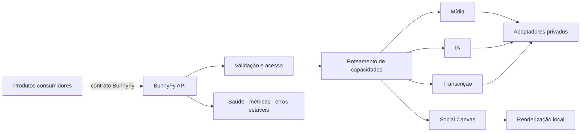
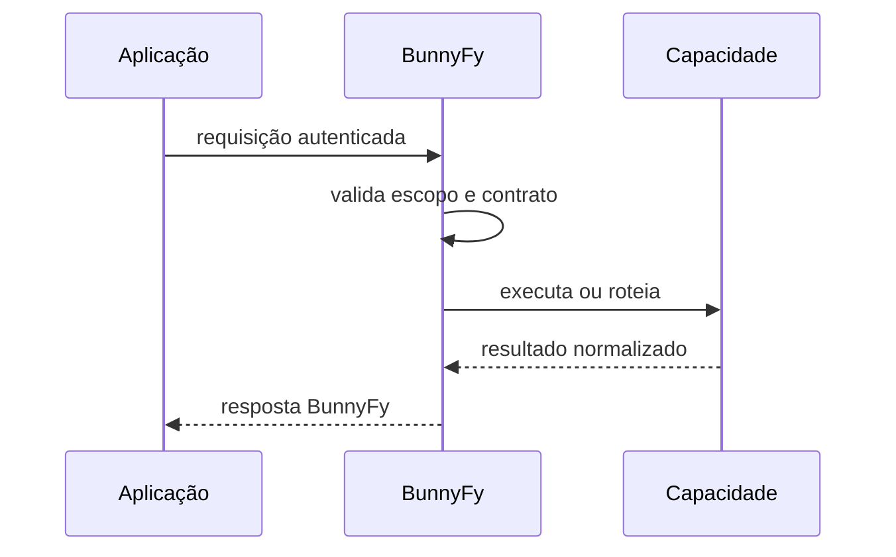

<h1 align="center">BunnyFy</h1>

  <strong>Media in. Power out.</strong> 
  Uma camada de processamento de mídia, IA e experiências visuais pensada para produtos que precisam fazer mais com menos acoplamento.

  
  
  
  
  

  <a href="#-o-que-%C3%A9-a-bunnyfy"><strong>Produto</strong></a>
  &nbsp;•&nbsp;
  <a href="#-capacidades"><strong>Capacidades</strong></a>
  &nbsp;•&nbsp;
  <a href="#-arquitetura"><strong>Arquitetura</strong></a>
  &nbsp;•&nbsp;
  <a href="#-o-que-este-reposit%C3%B3rio-mostra"><strong>Código público</strong></a>
  &nbsp;•&nbsp;
  <a href="#-seguran%C3%A7a-e-isolamento"><strong>Segurança</strong></a>

---

> [!IMPORTANT]
> **Este repositório é uma vitrine comercial e técnica da BunnyFy.** Ele contém documentação, contratos, exemplos e partes selecionadas da implementação para demonstrar arquitetura e qualidade de engenharia. O backend operacional completo, infraestrutura, credenciais, configuração de produção e mecanismos privados de operação **não são distribuídos por este repositório**.

## ✦ O que é a BunnyFy

<table>
<tr>
<td width="58%" valign="top">

A BunnyFy concentra tarefas que normalmente acabam espalhadas entre bots, scripts, serviços externos e credenciais difíceis de governar. Em vez de cada consumidor conhecer detalhes de provedores, formatos e subprocessos, ele conversa com uma superfície única e recebe contratos previsíveis.

O produto foi desenhado em torno de quatro ideias:

- **uma API, várias capacidades** de mídia e IA;
- **provedores ficam atrás da plataforma**, não dentro dos clientes;
- **falhas de uma capacidade não derrubam o restante**;
- **contratos estáveis** permitem trocar implementação sem reescrever consumidores.

</td>
<td width="42%" valign="top">

### Em uma frase

**Entrada:** mídia, prompt ou intenção.

**BunnyFy:** valida, roteia, processa, observa.

**Saída:** artefato pronto para consumo.

 

`Media in. Power out.`

</td>
</tr>
</table>

---

## ◈ Capacidades

<table>
<tr>
<td width="33%" valign="top">
<h3>🎞️ Media Pipeline</h3>
Download, normalização e transformação de mídia por uma camada que esconde peculiaridades dos provedores e mantém erros previsíveis para os consumidores.
</td>
<td width="33%" valign="top">
<h3>🖼️ Social Canvas</h3>
Renderização de cards e superfícies visuais para experiências sociais, perfis, jogos e respostas ricas sem obrigar o cliente a carregar um motor gráfico próprio.
</td>
<td width="33%" valign="top">
<h3>🧠 AI Gateway</h3>
Uma fronteira única para capacidades de IA. Modelo, provedor e credencial pertencem à plataforma; o cliente depende do contrato, não da marca por trás dele.
</td>
</tr>
<tr>
<td width="33%" valign="top">
<h3>🎙️ Áudio & Transcrição</h3>
Preparação de áudio e transcrição como capacidade isolada, com indisponibilidade localizada quando uma ferramenta específica não está pronta.
</td>
<td width="33%" valign="top">
<h3>✨ Image Routing</h3>
Roteamento de geração e processamento visual por intenção, com possibilidade de fallback e evolução de provedores sem expor essa dança ao consumidor.
</td>
<td width="33%" valign="top">
<h3>🔐 Access Layer</h3>
Autenticação, escopos, limites e observabilidade fazem parte da superfície da API. A integração não precisa carregar segredos dos provedores que a BunnyFy utiliza.
</td>
</tr>
</table>

---

## ⬡ Arquitetura

A linha que importa é simples: **consumidores conhecem a BunnyFy; a BunnyFy conhece os provedores**. Isso reduz credenciais espalhadas, dependência direta de terceiros e mudanças em cascata quando um fornecedor muda o próprio contrato numa terça-feira qualquer, como fornecedores adoram fazer.

---

## ◎ O que este repositório mostra

O snapshot público existe para tornar a engenharia observável sem transformar o produto em uma distribuição reproduzível da operação.

| Superfície pública | O que demonstra |
| --- | --- |
| contratos e tipos | formato esperado entre consumidor e API |
| rotas selecionadas | organização da superfície HTTP |
| bibliotecas escolhidas | tratamento de mídia, erros e capacidades |
| testes selecionados | invariantes e comportamento esperado |
| documentação técnica | decisões de arquitetura e integração |
| exemplos visuais | direção do Social Canvas e experiências da plataforma |

### O que fica fora

**Não fazem parte da distribuição pública:** topologia operacional completa, credenciais, segredos, configuração real de produção, mecanismos internos de deploy, material necessário para reproduzir o serviço integral e componentes que constituem vantagem operacional da plataforma.

> [!NOTE]
> Encontrar código neste repositório não significa que exista aqui um pacote de instalação da BunnyFy. **Não há promessa de `clone → npm start → serviço completo`.** A finalidade é avaliação técnica e apresentação do produto.

---

## ⇄ Relação com consumidores

A BunnyFy nasceu para servir aplicações reais, não para ser uma coleção abstrata de endpoints. O SHOGUN é um dos consumidores do ecossistema e usa a API como camada para capacidades que não deveriam ficar embutidas no processo do bot.

O consumidor não precisa receber token de provedor, interpretar envelopes diferentes para cada fornecedor ou saber qual backend executou uma capacidade específica.

---

## ⛨ Segurança e isolamento

A arquitetura separa **credenciais da plataforma** de **credenciais dos consumidores**. Provedores externos permanecem atrás da BunnyFy; clientes recebem apenas o nível de acesso necessário ao contrato autorizado.

Falhas de ferramentas e dependências são tratadas por capacidade sempre que possível. Uma função indisponível deve produzir um erro estável e observável, não transformar a API inteira numa pilha fumegante de `500` sem contexto.

O repositório público também é tratado como uma superfície de exposição: segredos, sessões, cookies, URLs assinadas e configuração operacional real não pertencem ao snapshot público.

---

## ◉ Estado do projeto

A BunnyFy segue em desenvolvimento ativo. O repositório público acompanha **recortes selecionados** da evolução técnica e visual do produto, não necessariamente cada detalhe do runtime privado no instante em que ele muda.

<table>
<tr>
<td align="center" width="25%"><strong>API</strong> contratos tipados</td>
<td align="center" width="25%"><strong>Mídia</strong> pipeline modular</td>
<td align="center" width="25%"><strong>IA</strong> gateway desacoplado</td>
<td align="center" width="25%"><strong>Visual</strong> Social Canvas</td>
</tr>
</table>

---

## Para avaliação técnica ou integração

Este espaço é o cartão técnico da BunnyFy: arquitetura, contratos, decisões de engenharia e exemplos suficientes para entender **o que a plataforma resolve e como ela pensa**, sem publicar o mapa completo da sala de máquinas.

  <strong>BunnyFy</strong> 
  Media in. Power out.

